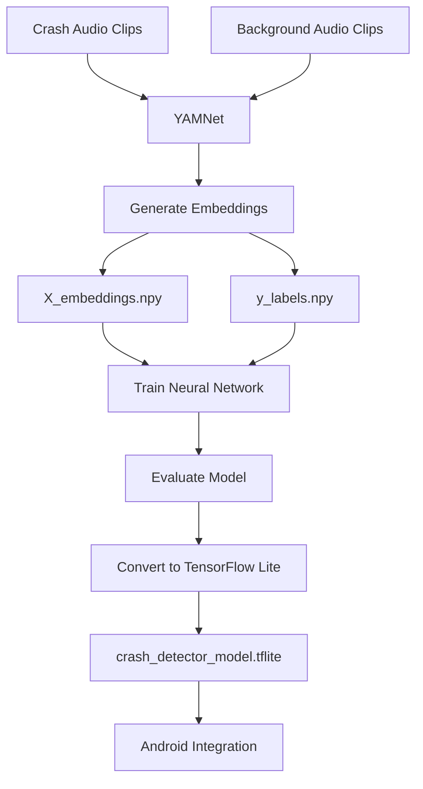

# 🚗 Crash Detection AI Module

This folder contains the Machine Learning pipeline used for real-time vehicle crash detection based on audio analysis.

---

## 🎯 Objective

The goal of this module is to detect potential vehicle accidents by analyzing environmental audio and identifying crash-related sound patterns.

The final model is optimized for deployment on mobile devices using TensorFlow Lite.

---

## 🏗️ System Architecture

```text
Audio Input
     │
     ▼
Audio Preprocessing
     │
     ▼
YAMNet Feature Extraction
     │
     ▼
Audio Embeddings (.npy)
     │
     ▼
Binary Classifier Training
     │
     ▼
Crash / Non-Crash Prediction
     │
     ▼
TensorFlow Lite Conversion
     │
     ▼
Android Application
```

---

## 🔄 Workflow



---

## 📊 Spectrogram Analysis

A spectrogram provides a visual representation of sound frequencies over time.

Crash sounds typically produce:

* Sudden high-energy spikes
* Wide frequency distribution
* Short-duration impact bursts
* Strong intensity compared to background noise

These characteristics help distinguish crash events from normal environmental sounds.

---

## 📁 Repository Contents

| File                          | Description                            |
| ----------------------------- | -------------------------------------- |
| `Crash_Detection_Final.ipynb` | Model training and evaluation notebook |
| `Example_Spectrograms.ipynb`  | Spectrogram visualization notebook     |
| `X_embeddings.npy`            | Extracted YAMNet embeddings            |
| `y_labels.npy`                | Corresponding labels                   |
| `crash_detector_model.tflite` | Final deployment model                 |
| `crash_urls.txt`              | Sources of crash audio samples         |
| `background_urls.txt`         | Sources of background audio samples    |

---

## 🧠 Model Details

* Feature Extractor: Google YAMNet
* Framework: TensorFlow
* Deployment Format: TensorFlow Lite
* Task: Binary Audio Classification
* Output Classes:

  * Crash
  * Non-Crash

---

## 📱 Deployment

The trained TensorFlow Lite model is integrated into the Android application for on-device inference.

This enables:

* Low latency predictions
* Reduced network dependency
* Mobile-friendly deployment

---

## 👥 Team Contribution

This module represents the AI component of the overall accident detection system and focuses on audio-based crash recognition using transfer learning and lightweight deployment techniques.

```
```
