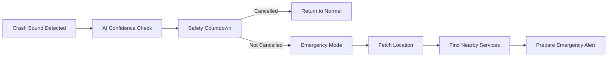
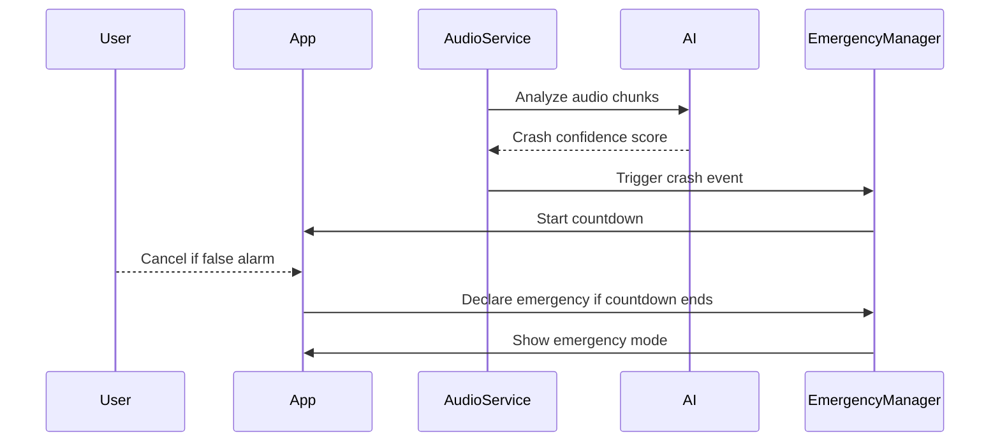

# 🚨 RoadSOS — Offline AI Crash Emergency Assistant

<div align="center">


<br/>


</div>

---

## 🌟 What is RoadSOS?

**RoadSOS** is an Android-based emergency assistant designed to detect possible road accidents using **on-device AI crash sound detection** and trigger an emergency flow.

It listens for crash-like sounds, starts a safety countdown, allows the user to cancel false alerts, and then activates emergency mode if the countdown completes.

RoadSOS is designed for situations where every second matters.



---

## 🚀 Key Features

### 🧠 AI Crash Detection

RoadSOS continuously monitors crash-like sounds using on-device audio processing.

* Local audio monitoring
* Crash confidence scoring
* Background listening through foreground service
* Reduces dependency on internet-based systems

---

### ⏱️ Smart SOS Countdown

When a possible crash is detected, RoadSOS starts a safety countdown before declaring an emergency.

```text
Crash Detected → Countdown Starts → User Can Cancel → Emergency Activated
```

This helps reduce false positives during testing and real-world usage.

---

### 🆘 Manual Emergency SOS

Users can also manually trigger SOS.

The SOS button has three smart states:

| State            | Button Action              |
| ---------------- | -------------------------- |
| Normal           | Starts emergency countdown |
| Countdown active | Cancels countdown          |
| Emergency active | Returns app to normal      |

---

### 📍 Live Location Support

RoadSOS fetches the user's current location and uses it during the emergency flow.

* Latitude and longitude display
* Accident location support
* External map/navigation intent support

---

### 🗺️ Emergency Radar Map

The Map screen shows a creative radar-style emergency service visualization.

* Accident point at center
* Nearby emergency services as radar dots
* Offline emergency service data support
* External map and route opening

---

### 👤 Medical Profile

On first launch, users are asked to enter basic emergency information:

* Name
* Blood group
* Emergency contact
* Weight
* Height
* Age

This data is stored locally and can be viewed from the Profile section.

---

### ⚙️ Permission Health Check

Settings include a clean permission status card.

It checks whether important permissions are granted:

* Microphone
* Location
* Phone
* SMS
* Notifications

If any required permission is missing, RoadSOS warns the user that the app may not function properly.

---

### 🔐 Local Data Storage

User profile information is stored locally using Android DataStore.

No unnecessary cloud dependency is required for the prototype.

---

## 📱 Screens / Modules

```text
RoadSOS
│
├── Home Screen
│   ├── Protection status
│   ├── Current location
│   ├── Crash detection status
│   └── Animated SOS button
│
├── Map Screen
│   ├── Emergency radar
│   ├── Nearby services
│   ├── Open map
│   └── Route navigation
│
├── Settings Screen
│   ├── Profile card
│   ├── Permissions manager
│   └── Logout / clear user data
│
└── Profile Screens
    ├── First-time profile setup
    └── Profile view/edit
```

---

## 🧩 Tech Stack

| Layer              | Technology                  |
| ------------------ | --------------------------- |
| Language           | Kotlin                      |
| UI                 | Jetpack Compose             |
| Architecture       | MVVM-style ViewModels       |
| Local Storage      | DataStore                   |
| Audio Monitoring   | AudioRecord                 |
| AI/ML              | TensorFlow Lite helper      |
| Background Task    | Foreground Service          |
| Navigation         | Jetpack Navigation Compose  |
| Location           | Android Location APIs       |
| Database Direction | Offline SQLite / Room-ready |

---


## ⚡ Emergency Flow



---

## 🛡️ Required Permissions

RoadSOS requires the following permissions for full functionality:

```xml
<uses-permission android:name="android.permission.RECORD_AUDIO" />
<uses-permission android:name="android.permission.ACCESS_FINE_LOCATION" />
<uses-permission android:name="android.permission.ACCESS_COARSE_LOCATION" />
<uses-permission android:name="android.permission.CALL_PHONE" />
<uses-permission android:name="android.permission.SEND_SMS" />
<uses-permission android:name="android.permission.POST_NOTIFICATIONS" />
<uses-permission android:name="android.permission.FOREGROUND_SERVICE" />
<uses-permission android:name="android.permission.FOREGROUND_SERVICE_MICROPHONE" />
<uses-permission android:name="android.permission.VIBRATE" />
<uses-permission android:name="android.permission.WAKE_LOCK" />
```

---

## 🧪 Prototype Testing Guide

### 1. Install APK

Build APK from Android Studio:

```bash
./gradlew assembleDebug
```

APK location:

```text
app/build/outputs/apk/debug/app-debug.apk
```

---

### 2. First Launch

When the app opens for the first time:

1. Fill profile details
2. Grant all permissions
3. Open Settings
4. Check permission status
5. Test manual SOS
6. Test Map screen

---

### 3. Background Detection Test

For best results:

* Keep RoadSOS installed
* Grant microphone permission
* Allow notifications
* Allow background activity from phone battery settings
* Play crash-like sound during testing

---

## 📸 Screenshots

Add your app screenshots here:

```text
assets/home_screen.png
assets/map_screen.png
assets/settings_screen.png
assets/profile_screen.png
```

Example:

```md


```

---

## 🎯 Why RoadSOS?

Road accidents often require immediate response, but many emergency systems depend on manual action or internet availability.

RoadSOS aims to provide:

* Faster crash awareness
* Offline-first emergency support
* Local AI processing
* Medical profile availability
* Nearby emergency service assistance
* False-alert cancellation window

---

## 💡 Hackathon Impact

RoadSOS is especially useful for:

* Highways
* Rural roads
* Low-network areas
* Solo riders/drivers
* Night travel
* Delayed emergency response zones

---

## 🧠 Future Scope

* Motion sensor crash detection
* Gyroscope + accelerometer fusion
* SMS alert with live location
* Emergency contact calling
* Offline SQLite emergency database integration
* Nearby hospital/police/fire/tow search
* Crash confidence explanation screen
* Demo mode for controlled hackathon presentation
* Wearable integration
* Cloud emergency dashboard

---

## 🧑‍💻 How to Run Locally

### Requirements

* Android Studio
* Kotlin support
* Android SDK
* Android phone or emulator
* Minimum Android version based on project configuration

### Steps

```bash
git clone https://github.com/your-username/RoadSOS.git
cd RoadSOS
```

Open in Android Studio.

Then:

```text
Sync Gradle → Build Project → Run App
```

---

## 📦 Build APK

Debug APK:

```bash
./gradlew assembleDebug
```

Release APK:

```bash
./gradlew assembleRelease
```

---

## 👥 Team

Add your team details here:

```text
Team Name: RoadSOS
Members:
- Name 1
- Name 2
- Name 3
- Name 4
```

---

## ⚠️ Disclaimer

RoadSOS is currently a prototype built for learning, testing, and hackathon demonstration purposes.

It should not be used as a certified emergency response system without proper validation, regulatory approval, and real-world testing.

---

## ❤️ Built With Purpose

<div align="center">

### 🚗 RoadSOS

**Because every second after a crash matters.**


</div>
